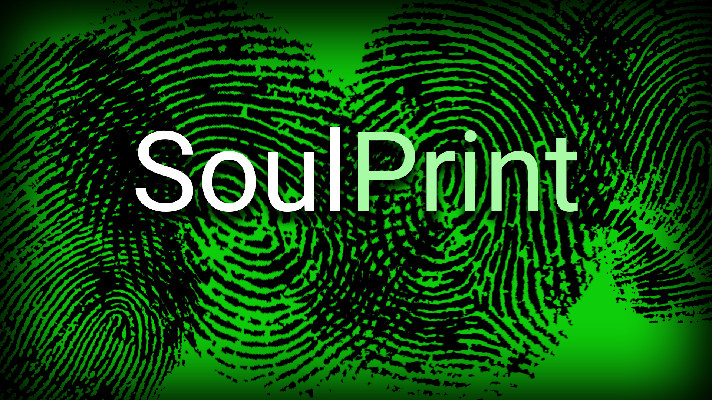
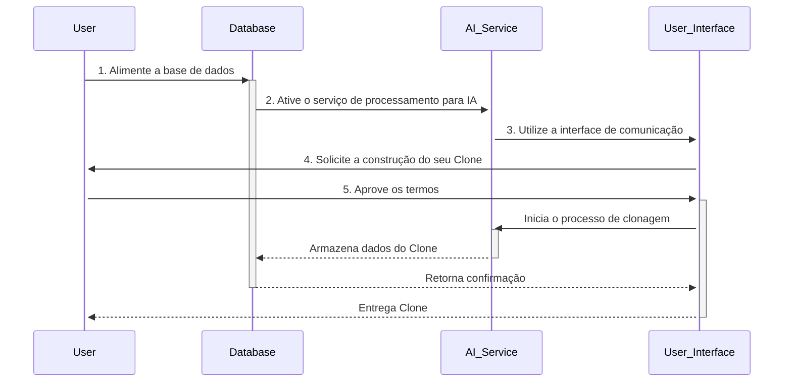

# SoulPrint

SoulPrint é uma inovação revolucionária que promete mudar a maneira como você se percebe e se lembra. É uma solução tecnológica que captura a essência única de cada indivíduo, transformando emoções, pensamentos e experiências em uma representação digital duradoura. Por meio de análises avançadas de expressões escritas, artísticas e atividades nas redes sociais, o SoulPrint cria um "clone digital" que reflete quem você realmente é. Com o SoulPrint, você tem a oportunidade de preservar uma década de suas memórias e emoções, eternizando sua alma para as gerações futuras. Esta incrível inovação é mais que um produto - é uma jornada de autodescoberta e preservação de memórias.

## Como funciona?

O Futuro da Autodescoberta e Preservação de Memórias.

Você já se perguntou se é possível preservar suas emoções, pensamentos e experiências para a eternidade? Bem, a resposta é sim! Apresentamos o revolucionário SoulPrint, uma inovação surpreendente que promete mudar a forma como você se vê e se lembra.

### Preserve suas memórias e emoções
Você é talentoso com as palavras? Você consegue expressar seus sentimentos e pensamentos através da arte? Você compartilha suas experiências nas redes sociais? Se sim, o SoulPrint é o produto ideal para você.

## Diário da alma: Um passo além
Se você mantém um diário e registra seus sentimentos e memórias todos os dias, imagine como seria ter uma década de suas emoções e experiências encapsuladas em um clone da sua alma. Com o SoulPrint, isso não é apenas um sonho - é uma realidade ao alcance das mãos.

## A ciência por trás da clonagem de almas
Nossa tecnologia inovadora analisa suas expressões escritas e artísticas, bem como suas atividades nas redes sociais, e cria uma representação digital da sua essência única. Essa representação, chamada de "clone da alma", é um reflexo verdadeiro e preciso do que torna você especial.

## A eternidade em um clone
Ao utilizar o SoulPrint por 10 anos, você estará armazenando uma década de emoções, memórias e experiências. Essa incrível inovação permite que você se "clone" e preserve sua essência para futuras gerações. Afinal, suas memórias e emoções são o que definem quem você é.

## Descubra o SoulPrint
Não perca a oportunidade de eternizar sua vida, suas emoções e suas experiências. Descubra o SoulPrint e embarque na jornada mais incrível de autodescoberta e preservação de memórias. Seja parte desta revolução e transforme a maneira como você se conecta consigo mesmo e com o mundo.

Por favor, note que este texto é uma criação fictícia e não deve ser interpretado como um produto real ou serviço disponível no mercado.

## Como adquirir ?

