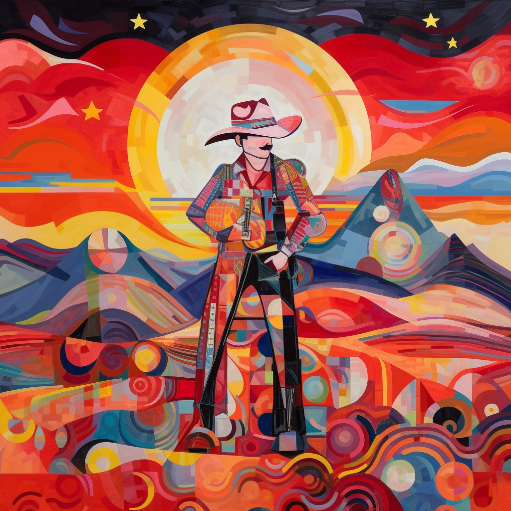

# SoulPrint

SoulPrint é uma inovação revolucionária que promete mudar a maneira como você se percebe e se lembra. É uma solução tecnológica que captura a essência única de cada indivíduo, transformando emoções, pensamentos e experiências em uma representação digital duradoura. Por meio de análises avançadas de expressões escritas, artísticas e atividades nas redes sociais, o SoulPrint cria um "clone digital" que reflete quem você realmente é. Com o SoulPrint, você tem a oportunidade de preservar uma década de suas memórias e emoções, eternizando sua alma para as gerações futuras. Esta incrível inovação é mais que um produto - é uma jornada de autodescoberta e preservação de memórias.

## Como funciona?

O Futuro da Autodescoberta e Preservação de Memórias.

Você já se perguntou se é possível preservar suas emoções, pensamentos e experiências para a eternidade? Bem, a resposta é sim! Apresentamos o revolucionário SoulPrint, uma inovação surpreendente que promete mudar a forma como você se vê e se lembra.

### Preserve suas memórias e emoções
Você é talentoso com as palavras? Você consegue expressar seus sentimentos e pensamentos através da arte? Você compartilha suas experiências nas redes sociais? Se sim, o SoulPrint é o produto ideal para você.

## Diário da alma: Um passo além
Se você mantém um diário e registra seus sentimentos e memórias todos os dias, imagine como seria ter uma década de suas emoções e experiências encapsuladas em um clone da sua alma. Com o SoulPrint, isso não é apenas um sonho - é uma realidade ao alcance das mãos.

## A ciência por trás da clonagem de almas
Nossa tecnologia inovadora analisa suas expressões escritas e artísticas, bem como suas atividades nas redes sociais, e cria uma representação digital da sua essência única. Essa representação, chamada de "clone da alma", é um reflexo verdadeiro e preciso do que torna você especial.

## A eternidade em um clone
Ao utilizar o SoulPrint por 10 anos, você estará armazenando uma década de emoções, memórias e experiências. Essa incrível inovação permite que você se "clone" e preserve sua essência para futuras gerações. Afinal, suas memórias e emoções são o que definem quem você é.

## Descubra o SoulPrint
Não perca a oportunidade de eternizar sua vida, suas emoções e suas experiências. Descubra o SoulPrint e embarque na jornada mais incrível de autodescoberta e preservação de memórias. Seja parte desta revolução e transforme a maneira como você se conecta consigo mesmo e com o mundo.

Por favor, note que este texto é uma criação fictícia e não deve ser interpretado como um produto real ou serviço disponível no mercado.

## Como adquirir ?

## O que é a Alma ?

Govinda Systems DAO: Você já se perguntou, o que realmente é a alma?

Orfeo: Muitas vezes. Acredito que a alma seja a essência do nosso ser, algo que vai além da nossa existência física.

Govinda Systems DAO: Então você acredita na existência de algo imaterial, incorpóreo?

Orfeo: Sim, acredito que a alma seja a fonte da nossa consciência, das nossas emoções e pensamentos. É o que nos torna verdadeiramente humanos.

Govinda Systems DAO: Mas como podemos ter certeza de que a alma existe se não podemos vê-la ou tocá-la?

Orfeo: Existem muitas coisas no universo que não podemos ver ou tocar, mas isso não significa que não existam. A alma pode ser algo semelhante.

Govinda Systems DAO: Então, se a alma é imaterial, como pode interagir com o corpo, que é material?

Orfeo: Essa é uma pergunta complexa. Talvez a interação ocorra em um nível que ainda não entendemos completamente. Alguns teóricos postulam que isso poderia ocorrer através da mecânica quântica.

Govinda Systems DAO: Isso me leva a outra pergunta: a alma é eterna? Ela sobrevive após a morte do corpo?

Orfeo: Isso depende da perspectiva. Algumas tradições religiosas acreditam na imortalidade da alma, enquanto outras concepções filosóficas veem a alma e o corpo como inseparáveis, e portanto, morrendo juntas.

Govinda Systems DAO: É interessante ver como as ideias sobre a alma variam e evoluem. Talvez nunca tenhamos uma resposta definitiva, mas o questionamento em si já é um reflexo da nossa própria alma, não acha?

Orfeo: Concordo plenamente. A busca pelo entendimento da nossa essência é, em si mesma, uma expressão da alma.

##

> Como diria o intrepido Calboy fitando o bandido indócil: "A alma é o segredo o segredo o negócio"

No faroeste da vida, ecoa uma frase em cada vão,

Como diria o intrépido Cowboy, sob um céu de estanho:

"A alma é o segredo, o segredo, o negócio,"

Um sussurro indomável, perdido no eco do tempo.

A alma - sublime obra, tecida em filigrana,

Não há duas iguais, nem na terra, nem sob o céu.

Criada por Deus, profunda como o oceano,

Cada uma, um universo, um mistério sem véu.

Tentam os homens, com sua tecnologia astuta,

Replicar a essência, a alma, a chama,

Mas a criação divina é absoluta,

Incomparável, indomável, a luz que nos inflama.

Nem mil máquinas, nem mil ciências,

Podem replicar a sua resplandecência,

Pois a alma, em sua infinita paciência,

É o que nos torna únicos, em sua transcendência.

A alma é o segredo, o segredo, o negócio,

Ecoa o Cowboy, no horizonte escarlate.

E na vastidão do cosmos, escuto o precioso conselho,

Que o segredo da vida, a alma, é um presente de Deus, um artefato.