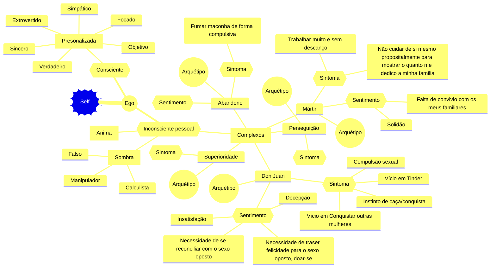

```mermaid
mindmap
  root))Self((
    ::icon(fa fa-person)
    ((Ego))
        {{Consciente}}
            [Presonalizada]
            ::icon(fa fa-theater-masks)
                Simpático
                Extrovertido
                Focado
                Objetivo
                Sincero
                Verdadeiro
        {{Inconsciente pessoal}}
            [Complexos]
            ::icon(fas fa-yin-yang)
                Abandono
                    ((Arquétipo))
                    {{Sintoma}}
                        Vício (Fumar maconha de forma compulsiva)
                    {{Sentimento}}
                Mártir
                    ((Arquétipo))
                    {{Sintoma}}
                        Trabalhar muito e sem descanço
                        Não cuidar de si mesmo propositalmente para mostrar o quanto me dedico a minha familia
                    {{Sentimento}}
                        Solidão
                        Falta de convivio com os meus familiares
                Don Juan
                    ((Arquétipo))
                    {{Sintoma}}
                        Vício em Tinder
                        Vício em Conquistar outras mulheres
                        Instinto de caça/conquista
                        Compulsão sexual
                    {{Sentimento}}
                        Insatisfação
                        Decepção
                        Necessidade de se reconciliar com o sexo oposto
                        Necessidade de traser felicidade para o sexo oposto, doar-se
                Superioridade
                    ((Arquétipo))
                    {{Sintoma}}
                Perseguição
                    ((Arquétipo))
                    {{Sintoma}}
            [Anima]
            ::icon(fas fa-female)
            [Sombra]
            ::icon(fa fa-skull)
                Falso
                Manipulador
                Calculista
```

https://mermaid.js.org/syntax/mindmap.html

